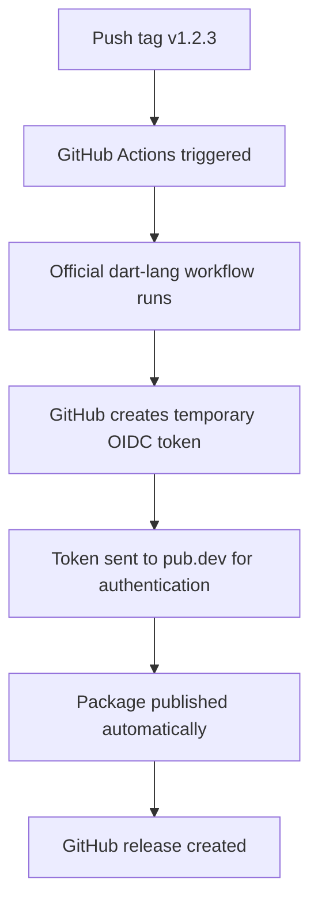

# 🔐 Official pub.dev Automated Publishing Setup

Based on the official Dart documentation, here's how to set up **secure, automated publishing** using GitHub Actions OIDC (no long-lived secrets needed!).

## 📋 **Prerequisites**

1. ✅ Your package must already be published once manually: `dart pub publish`
2. ✅ You must be an **uploader** or **admin** of the package on pub.dev
3. ✅ Repository must be on GitHub

## 🚀 **Step-by-Step Setup**

### **Step 1: Configure Automated Publishing on pub.dev**

1. **Navigate to your package admin page:**
   - Go to: https://pub.dev/packages/dep_audit/admin
   - You must be logged in as an uploader/admin

2. **Enable GitHub Actions Publishing:**
   - Find the **"Automated publishing"** section
   - Click **"Enable publishing from GitHub Actions"**
   - Fill in the form:
     - **Repository**: `B33b3k/dep_audit`
     - **Tag pattern**: `v{{version}}`

   

3. **Optional: Require GitHub Environment (Recommended for Security):**
   - Click **"Require GitHub Actions environment"**
   - **Environment name**: `pub-dev`
   - This adds an extra security layer

### **Step 2: Create GitHub Environment (If Required)**

If you enabled environment requirement:

1. **Go to your repository settings:**
   - https://github.com/B33b3k/dep_audit/settings
   - Click **"Environments"** in the left sidebar

2. **Create new environment:**
   - Name: `pub-dev`
   - **Optional**: Add protection rules (required reviewers, etc.)

### **Step 3: Update Release Workflow (Already Done!)**

✅ Your `.github/workflows/release.yml` is already updated to use the official workflow.

### **Step 4: Test the Setup**

1. **Update your version:**
   ```bash
   # Update version in pubspec.yaml to 0.1.4 (or next version)
   ```

2. **Create and push a tag:**
   ```bash
   git tag v0.1.4
   git push origin v0.1.4
   ```

3. **Monitor the workflow:**
   - Check: https://github.com/B33b3k/dep_audit/actions
   - The official workflow will handle authentication automatically!

## 🔒 **Security Benefits of OIDC**

### **What This Setup Provides:**
- ✅ **No long-lived secrets** in GitHub
- ✅ **Temporary tokens** signed by GitHub
- ✅ **Automatic authentication** with pub.dev
- ✅ **Audit trail** of all publications
- ✅ **Optional approval workflows**

### **Old vs New Authentication:**
```bash
# ❌ Old way (requires PUB_CREDENTIALS secret):
echo "$PUB_CREDENTIALS" | dart pub token add https://pub.dev
dart pub publish --force

# ✅ New way (automatic OIDC):
# No manual token management needed!
# GitHub automatically provides temporary tokens
```

## 📊 **What Happens When You Push a Tag**



## 🧪 **Testing Your Setup**

### **Dry Run Test (Recommended First):**
```bash
# Test locally first:
dart pub publish --dry-run

# Then test the automation:
git tag v0.1.4-test
git push origin v0.1.4-test
# Check if workflow runs (will publish to pub.dev!)
```

### **Production Release:**
```bash
# Make sure pubspec.yaml version matches tag:
# version: 0.1.4

git tag v0.1.4
git push origin v0.1.4
```

## 📝 **Important Notes**

### **Tag Pattern Matching:**
- **pub.dev setting**: `v{{version}}`
- **GitHub workflow**: `v[0-9]+.[0-9]+.[0-9]+`
- **Git tag**: `v1.2.3`
- **pubspec.yaml**: `version: 1.2.3`

All of these **MUST match** for publishing to work!

### **First-Time Setup Checklist:**
- [ ] Package published manually at least once
- [ ] GitHub Actions enabled on pub.dev
- [ ] Tag pattern configured: `v{{version}}`
- [ ] Repository specified: `B33b3k/dep_audit`
- [ ] Workflow file updated (✅ done)
- [ ] Environment created (if required)

## 🔧 **Troubleshooting**

### **Common Issues:**

1. **Workflow doesn't trigger:**
   - Check tag pattern matches exactly
   - Ensure you pushed the tag: `git push origin v1.2.3`

2. **Authentication fails:**
   - Verify repository name is exact: `B33b3k/dep_audit`
   - Check if environment is required and configured

3. **Version mismatch:**
   - Ensure `pubspec.yaml` version matches git tag version

### **Verification Steps:**
```bash
# Check current setup:
git remote -v  # Verify repository URL
cat pubspec.yaml | grep version  # Check version
git tag -l  # List existing tags
```

## 🎉 **Benefits of This Setup**

- 🔐 **Maximum Security**: No secrets to manage
- ⚡ **Zero Configuration**: After initial setup
- 📊 **Full Audit Trail**: Every publish is logged
- 🤖 **Fully Automated**: Tag → Publish → Release
- 🛡️ **Official Support**: Maintained by Dart team

Your package is now ready for **professional, secure, automated publishing**! 🚀